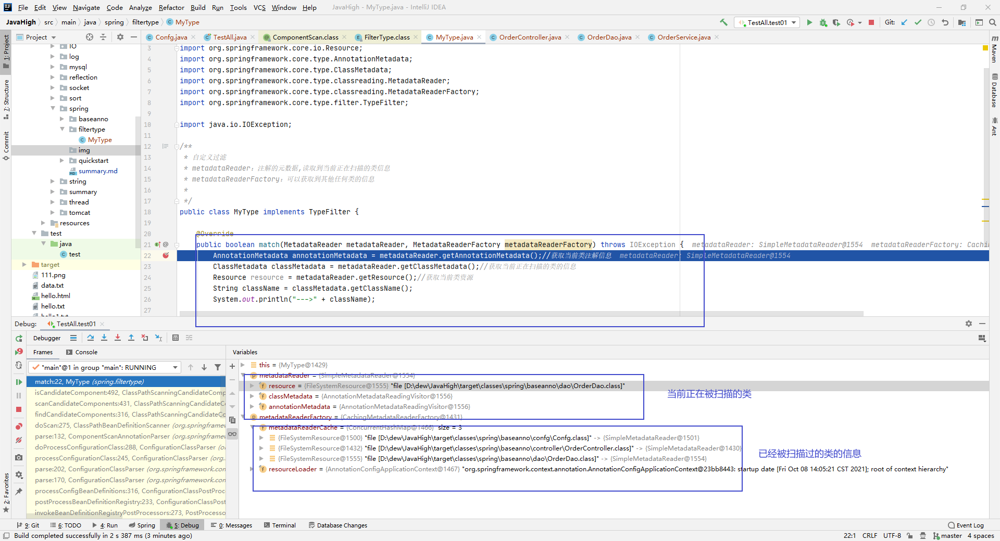

# Spring

```xml
Spring 是一种开源轻量级框架，是为了解决企业应用程序开发复杂性而创建的
Spring致力于解决Java EE的各层解决方案，而不仅仅于某一层的方案

spring的目标：
	1.让现有的技术更容易使用
	2.促进良好的编程习惯
```

## spring体系结构

```xml
spring core:spring核心，它是框架的最基础的部分，提供IOC和依赖注入特性
spring context:上下文容器，它是BeanFactory功能加强的一个子接口
spring web:它提供web应用开发的支持
spring mvc:它针对web应用中mvc思想的实现
spring dao:它针对jdbc抽象层，简化了jdbc编码，同时，编码更具有健壮性
spring orm:它支持用于流行的orm框架的整合
spring aop:面向切面编程
```

## ComponentScan

```xml
@ComponentScan(value = "spring.baseanno")
扫描指定包下类的组件

includeFilters：包含指定

excludeFilters：排除指定
```

```java
包含指定，需要将useDefaultFilters设置为false即可正常使用，只注册带Controller注解的
@ComponentScan(value = "spring.baseanno",includeFilters = {
        @Filter(type = FilterType.ANNOTATION,classes = {Controller.class})
},useDefaultFilters = false)
  
排除指定，需要将useDefaultFilters设置为true(默认就是true)即可正常使用，排除带Controller注解的
@ComponentScan(value = "spring.baseanno",excludeFilters = {
        @Filter(type = FilterType.ANNOTATION,classes = {Controller.class})
},useDefaultFilters = true)
  

FilterType可以使用以下类型
ANNOTATION,
ASSIGNABLE_TYPE,
ASPECTJ,
REGEX,
CUSTOM;

按类型注册，排除OrderController类
@ComponentScan(value = "spring.baseanno",excludeFilters = {
        @Filter(type = FilterType.ASSIGNABLE_TYPE,classes = {OrderController.class})
},useDefaultFilters = true)

自定义类型
@ComponentScan(value = "spring.baseanno",includeFilters = {
        @Filter(type = FilterType.CUSTOM,classes = {MyType.class})
},useDefaultFilters = false)
  
useDefaultFilters = true
有组件配置相关注解的，会启用默认的配置，没有则启用自定义或者规定的
  
ComponentScans:配置多个扫描规则，满足其中之一就行了，是 || 的关系
@ComponentScans({
        @ComponentScan(value = "spring.baseanno",includeFilters = {
                @Filter(type = FilterType.CUSTOM,classes = {MyType.class})
        },useDefaultFilters = false),
        @ComponentScan(value = "spring.baseanno",includeFilters = {
                @Filter(type = FilterType.ANNOTATION,classes = {Controller.class})
        },useDefaultFilters = false)
})
```



修改为

```java
package spring.filtertype;

import org.springframework.core.io.Resource;
import org.springframework.core.type.AnnotationMetadata;
import org.springframework.core.type.ClassMetadata;
import org.springframework.core.type.classreading.MetadataReader;
import org.springframework.core.type.classreading.MetadataReaderFactory;
import org.springframework.core.type.filter.TypeFilter;

import java.io.IOException;

/**
 * 自定义过滤
 * metadataReader：注解的元数据,读取到当前正在扫描的类信息
 * metadataReaderFactory：可以获取到其他任何类的信息
 *
 */
public class MyType implements TypeFilter {

    @Override
    public boolean match(MetadataReader metadataReader, MetadataReaderFactory metadataReaderFactory) throws IOException {
        AnnotationMetadata annotationMetadata = metadataReader.getAnnotationMetadata();//获取当前类注解信息
        ClassMetadata classMetadata = metadataReader.getClassMetadata();//获取当前正在扫描的类的信息
        Resource resource = metadataReader.getResource();//获取当前类资源
        String className = classMetadata.getClassName();
        /**
         * 对spring内置的bean的注册是不起作用的
         * --->spring.baseanno.controller.OrderController
         * --->spring.baseanno.dao.OrderDao
         * --->spring.baseanno.service.OrderService
         * --->spring.baseanno.TestAll
         */
        System.out.println("--->" + className);
        if (className.contains("er")){
            System.out.println("添加-->" + className);
            return true;
        }
        return false;
    }
}
```

结果为：

```xml
--->spring.baseanno.controller.OrderController
添加-->spring.baseanno.controller.OrderController
--->spring.baseanno.dao.OrderDao
添加-->spring.baseanno.dao.OrderDao
--->spring.baseanno.service.OrderService
添加-->spring.baseanno.service.OrderService
--->spring.baseanno.TestAll
org.springframework.context.annotation.internalConfigurationAnnotationProcessor   org.springframework.context.annotation.ConfigurationClassPostProcessor@323b36e0
org.springframework.context.annotation.internalAutowiredAnnotationProcessor   org.springframework.beans.factory.annotation.AutowiredAnnotationBeanPostProcessor@44ebcd03
org.springframework.context.annotation.internalRequiredAnnotationProcessor   org.springframework.beans.factory.annotation.RequiredAnnotationBeanPostProcessor@694abbdc
org.springframework.context.annotation.internalCommonAnnotationProcessor   org.springframework.context.annotation.CommonAnnotationBeanPostProcessor@2e005c4b
org.springframework.context.event.internalEventListenerProcessor   org.springframework.context.event.EventListenerMethodProcessor@4567f35d
org.springframework.context.event.internalEventListenerFactory   org.springframework.context.event.DefaultEventListenerFactory@5ffead27
confg   spring.baseanno.confg.Confg$$EnhancerBySpringCGLIB$$2ca232a0@6356695f
orderController   spring.baseanno.controller.OrderController@4f18837a
orderDao   spring.baseanno.dao.OrderDao@359f7cdf
orderService   spring.baseanno.service.OrderService@1fa268de
person   Person{name='null', age=null}
```

将其自定义规则修改为

```java
className.contains("Dao")
```

将配置类上的扫描改为

```java
@ComponentScans({
        @ComponentScan(value = "spring.baseanno",includeFilters = {
                @Filter(type = FilterType.CUSTOM,classes = {MyType.class})
        },useDefaultFilters = false),
        @ComponentScan(value = "spring.baseanno",includeFilters = {
                @Filter(type = FilterType.ANNOTATION,classes = {Controller.class})
        },useDefaultFilters = false)
})
```

得到结果为

```xml
--->spring.baseanno.controller.OrderController
--->spring.baseanno.dao.OrderDao
添加-->spring.baseanno.dao.OrderDao
--->spring.baseanno.service.OrderService
--->spring.baseanno.TestAll
org.springframework.context.annotation.internalConfigurationAnnotationProcessor   org.springframework.context.annotation.ConfigurationClassPostProcessor@5af3afd9
org.springframework.context.annotation.internalAutowiredAnnotationProcessor   org.springframework.beans.factory.annotation.AutowiredAnnotationBeanPostProcessor@323b36e0
org.springframework.context.annotation.internalRequiredAnnotationProcessor   org.springframework.beans.factory.annotation.RequiredAnnotationBeanPostProcessor@44ebcd03
org.springframework.context.annotation.internalCommonAnnotationProcessor   org.springframework.context.annotation.CommonAnnotationBeanPostProcessor@694abbdc
org.springframework.context.event.internalEventListenerProcessor   org.springframework.context.event.EventListenerMethodProcessor@2e005c4b
org.springframework.context.event.internalEventListenerFactory   org.springframework.context.event.DefaultEventListenerFactory@4567f35d
confg   spring.baseanno.confg.Confg$$EnhancerBySpringCGLIB$$bf42c3b@5ffead27
orderDao   spring.baseanno.dao.OrderDao@6356695f
orderController   spring.baseanno.controller.OrderController@4f18837a
person   Person{name='null', age=null}
```

具体见相关代码


